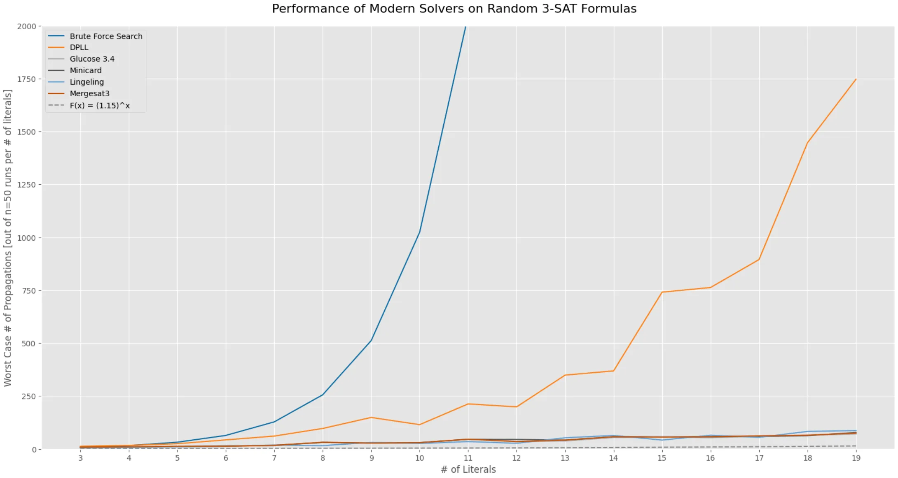

# EasySAT

 


What is this repo?
```
A toolkit for exploration of SAT (Boolean Satisfiability) problems in Python. EasySAT provides a set of
utilities for generating, solving, and analyzing SAT instances of various kinds. It is meant primarily
for students and those new to problems in boolean satisfiability, to quickly "get their hands dirty"
without diving into more sophisticated libraries. 
```

What are some of the things it can do currentely?
```
1) Generate random K-SAT formula with a set number of clauses and literals.
2) Read in formulas from different benchmarks (in .cnf format).
3) Test multiple solvers including BFS, DPLL, CaDiCaL, Glucose, Minicard and more.
4) Implement custom solvers and benchmark them against existing implementations.
```

Are there sample tutorials to get started with?
```
Yes! Look under ./Samples/Notebooks
```

## Installation
```
pip install easysat
```

## Examples
Generate a random 3-SAT instance and solve it using DPLL
```
from easysat.generators import KSAT_Generator
from easysat.solvers import DPLL

ksat_generator = KSAT_Generator()
instance = ksat_generator.random_kcnf(k = 3, n_literals = 3, n_conjuncts=5)

# [[-2, 2, 1], [3, 2, -3], [2, 1, -3], [3, 2, 1], [2, -1, 1]]

dpll_solver = DPLL()
dpll_solver.append_formula(instance)
dpll_solver.solve()

# > (True, [2], 2) -> (satisfiable, satisfying model, # of variable propagations)
```

Read a K-SAT instance from a DIMACS file and solve it using Glucose
```
from easysat.generators import KSAT_Generator
from pysat.solvers import Glucose42

ksg = KSAT_Generator()
dimacs_file = './/Data//aim//aim-100-3_4-yes1-4.cnf'
instance = ksg.from_dimacs_file(dimacs_file, 0)

glucose_solver = Glucose42()
glucose_solver.append_formula(statement)
glucose_solver.solve() 
#glucose_solver.accum_stats()['propagations']
#glucose_solver.get_model()

# > True
```

Read a K-SAT instance from a DIMACS file and describe variable activity
```
from easysat.generators import KSAT_Generator
from pysat.solvers import Glucose42

ksg = KSAT_Generator()
dimacs_file = './/Data//aim//aim-100-3_4-yes1-4.cnf'
instance = ksg.from_dimacs_file(dimacs_file, 0)
ksg.describe_literal(instance, 2)

# > {'pos_activity': 1,
# 'neg_activity': 7,
# 'correlations': {2, 31},
# 'entanglements': {29, 32, 49, 55, 59, 86, 87, 95}}
```

## References
- [PySAT, SAT Technology in Python](https://pysathq.github.io/)
- [Dave Fernig, Solving SAT in Python (2018)](https://davefernig.com/2018/05/07/solving-sat-in-python/)

If EasySAT helped your research, please cite it using the button on the top right or using the following bibtex:
```
@software{Shairoz_Sohail_EasySAT,
author = {Shairoz Sohail},
license = {MIT},
title = {{EasySAT}},
url = {https://github.com/ShairozS/EasySAT}
}
```
